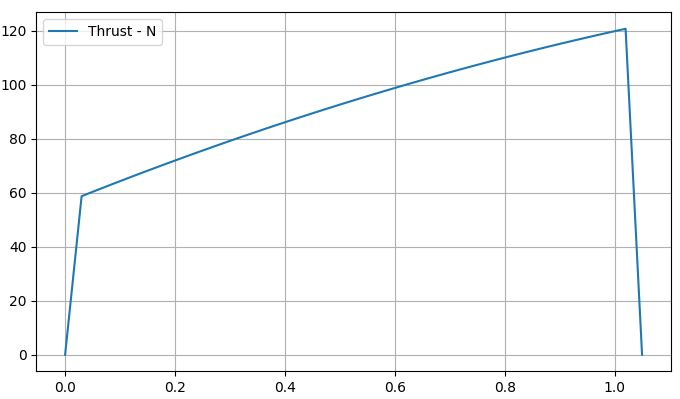

# Updated proposed N1-Motor
Grain Diameter 30mm \
Grain Length 150mm
performance | KNSU V6 | KNSU V7 | KNDX V8 | KNDX V9 
--- | --- | --- | --- | --- 
Designation | F87 | F92 | F65 | F63
Impulse | 67.07 | 66.91 | 70.37 | 72.65
Propellant mass (Kg) | 0.13 | 0.14 | 0.15 | 0.15
Average Pressure (MPa) | 1.45 | 1.80 | 1.87 | 1.83
Peak Pressure (MPa) | 1.89 | 2.40 | 2.33 | 2.31
Core (mm) | 17 | 16 | 14 | 13
Throat (mm) | 12 | 11 | 9 | 9
Burn Time (s) | 0.69 | 0.69 | 1.05 | 1.11
Rasp File | [ENG FILE](V6-KNSU/V6-KNSU.eng)| [ENG FILE](V7-KNSU/V7-KNSU.eng)| [ENG FILE](V8-KNDX/V8-KNDX.eng)| [ENG FILE](V8-KNDX/V8-KNDX.eng)
Thrust Curve |  |  |  | 

# Motor selection
https://docs.google.com/spreadsheets/d/1xEjgxcizVEla5WYd4yQHLdHGN3GgNQR9PQ9QDNRd-24/edit?pli=1#gid=1338705104

# New motor specifications with nozzles

Grain Diameter 30mm \
Grain Length 130mm

performance | KNSU v10 | KNDX v11
--- | --- | ---
Designation | G146 | G106
Impulse(Ns) | 109.61 | 115.36
Propellant mass (Kg) | 0.12 | 0.13
Average Pressure (MPa) | 1.46 | 1.46
Peak Pressure (MPa) | 1.89 | 1.79
Core (mm) | 16 | 14
Throat (mm) | 11 | 9.5
Burn Time (s) | 0.72 | 1.05
Rasp File | [ENG FILE](V10-KNSU/N1-V10-KNSU.eng) | [ENG FILE](V11-KNDX/N1-V11-KNDX.eng)
Thrust Curve |  | 