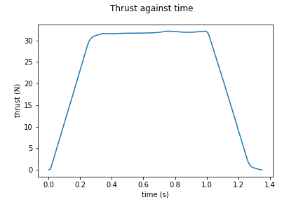
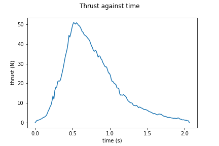

#N1 - Test motors

Details |V6 | V7 
--- | --- | --- 
Total Impulse (N-s)| 31.58 | 36.08 
Specific Impulse (N-s/Kg) | 242.90 | 257.71
Average Thrust (N) | 23.39 | 17.49 
Peak Thrust (N) | 32 | 51
Motor Class| E | E
Fuel | Sucrose | Sucrose 
Rasp File | [File](n1-v6.eng) | [File](n1-v7.eng) 
Thrust Curve |  | 
