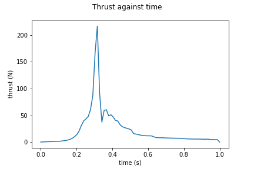
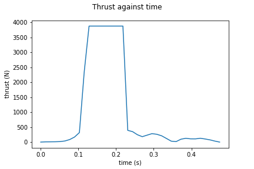

# N1 - Test motors

Details |V7-control | V7-nozzle
--- | --- | --- 
Total Impulse (N-s)| 21.40 | N/A 
Specific Impulse (N-s/Kg) | 152.88 | N/A
Average Thrust (N) | 21.40 | N/A 
Peak Thrust (N) | 216.801 | N/A
Motor Class| E | N/A
Fuel | Sucrose | Sucrose 
Rasp File | [File](v7-control.eng) | N/A
Thrust Curve |  | 

## Notes
The control version had a failure on the nozzle but some data was still collected.
The failure of the nozzle might have resulted from shortcomings in the nozzle construction or rapid increase in chamber pressure above the design parameters of the nozzle. \
The nozzle version had a catastrophic failure resulting in the loss of the test stand. 
The data gathered was not useful as it exceeds the measurable limit of the load cells as well as the test stand being destroyed.