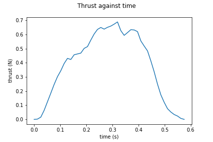
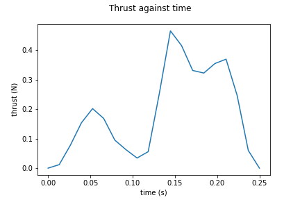
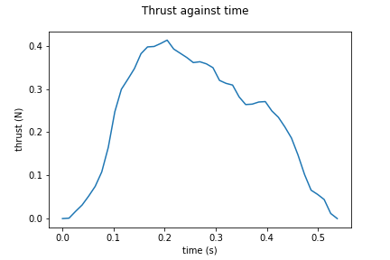

#N1 - Test motors

Details |Motor 1 | Motor 2 | Motor 3
--- | --- | --- | ---
Total Impulse| 0.22 | 0.05 | 0.12
Specific Impulse| 14.57 | 3.29 | 8.2
Average Thrust| 0.38 | 0.18 | 0.23
Motor Class| micro | micro | micro 
Fuel | Sucrose | Dextrose | Sucrose
Rasp File | [File](n1-t1-m1.eng) | [File](n1-t1-m2.eng) | [File](n1-t1-m3.eng)
Thrust Curve |  |  | 
